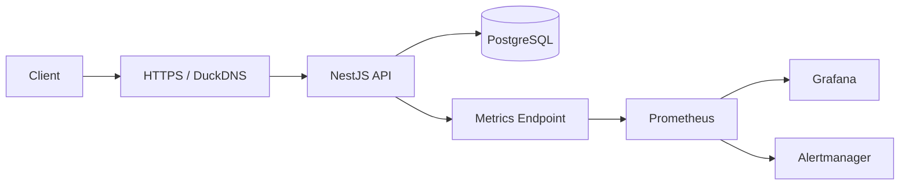

# DevOps Task Manager API


## Project Overview

A production-ready task management REST API built with NestJS and PostgreSQL. The system is containerized, deployed on hardened AWS infrastructure, automated with CI/CD, and backed by real-time monitoring and alerting.

## Key Features & Demonstrated Skills

### Backend & Security

- JWT access and refresh tokens stored in HttpOnly cookies.
- Google OAuth 2.0 authentication integration.
- Role-Based Access Control (RBAC).
- Global interceptors and exception handling.
- Secure password reset, email verification, and session management.

### DevOps & Infrastructure

- Hosted on an Ubuntu-based AWS EC2 instance.
- Configured EC2 Security Groups with restricted inbound access.
- DuckDNS domain with Nginx reverse proxy and SSL/HTTPS via Certbot.
- Multi-container Docker Compose setup for the API, database, and monitoring stack.
- Persistent Docker volumes and production-oriented service isolation.

### Observability & Monitoring

- Application and infrastructure health checks.
- Prometheus metrics collection and scraping.
- Grafana dashboards for system and application visibility.
- Node Exporter for host-level metrics.
- Alertmanager and Grafana alert rules with Telegram notifications.

### CI/CD Automation

- GitHub-based workflow using feature branches, pull requests, and controlled merges into `main`.
- Pull requests trigger GitHub Actions checks to validate changes before merge.
- CI pipeline runs automated checks, builds the Docker image, and verifies the application before release.
- CD pipeline deploys the validated version automatically to the Ubuntu-based AWS EC2 server after merge.
- Reproducible delivery flow: `branch -> pull request -> review/checks -> merge -> deploy`.

## Architecture & Data Flow



## Live Demo & Quick Start

- **Live health check:** [task-manager-devops-project-api.duckdns.org/health](https://task-manager-devops-project-api.duckdns.org/health)

```bash
docker compose up -d
```
