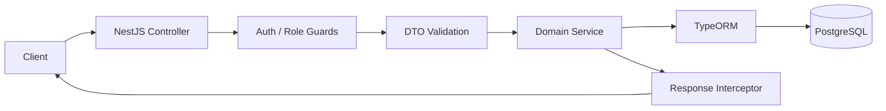

# Task Manager API


## Backend Overview

The backend service for **DevOps Task Manager** is a modular REST API built with NestJS, TypeScript, PostgreSQL, and TypeORM. It provides authenticated task management, secure user flows, session-based refresh token rotation, and production-focused request validation and response handling.

This is the current backend implementation behind the deployed project, not a framework starter template.

## What This Backend Demonstrates

### Authentication & Security

- JWT access and refresh token authentication using HttpOnly cookies.
- Google OAuth 2.0 login with Passport.
- Refresh session persistence, token hashing, expiry checks, and revocation on logout.
- Role-aware authorization guards and current-user decorators.
- Password hashing with `bcrypt`.
- Email verification and password reset token flows.
- Password reset revokes active refresh sessions after a successful change.

### API Engineering

- Feature-based NestJS modules: `auth`, `users`, `tasks`, and `sessions`.
- DTO validation with `class-validator` and `class-transformer`.
- Global validation pipe with whitelisting and rejection of unknown fields.
- Global response transformation through a NestJS interceptor.
- Centralized authentication and role guards.
- UUID route parameter validation for task resources.
- Transactional password reset updates through TypeORM.

### Data Layer

- PostgreSQL as the relational database.
- TypeORM entities and repositories for users, tasks, refresh sessions, email verification tokens, and password reset tokens.
- Persistent Docker volume support for local and deployed environments.
- Database configuration loaded through environment variables.

## Core API Surface

| Area | Endpoints | Purpose |
|---|---|---|
| Authentication | `/api/auth/register`, `/login`, `/refresh`, `/logout` | Account creation and cookie-based sessions |
| Social login | `/api/auth/google`, `/google/callback` | Google OAuth 2.0 authentication |
| Account recovery | `/api/auth/verify-email`, `/resend-verification`, `/forgot-password`, `/reset-password` | Verification and password recovery flows |
| Current user | `/api/auth/me` | Return the authenticated user profile |
| Tasks | `/api/tasks` | Create, list, update, change status, and delete user-owned tasks |
| Users | `/api/users`, `/api/users/me/password` | User administration and password changes |
| Health | `/health` | Service health check used by Docker and deployment monitoring |

All task write and read operations are protected by the authentication guard and scoped to the current user.

## Request Flow



## Project Structure

```text
src/
├── auth/       # JWT, Google OAuth, verification, and password recovery
├── users/      # User accounts and password management
├── tasks/      # Authenticated task CRUD and status updates
├── sessions/   # Refresh session persistence and revocation
├── common/     # Guards and global request/response interceptors
└── config/     # Database configuration
```

## Local Development

### Prerequisites

- Node.js 20+
- PostgreSQL, or Docker Desktop
- Environment variables for the database and authentication providers

### Install and Run

```bash
npm install
npm run start:dev
```

Run the complete local API and PostgreSQL setup from the repository root:

```bash
docker compose up -d
```

The API is available at `http://localhost:3000` and the health endpoint is `http://localhost:3000/health`.

## Quality Checks

```bash
npm run build
npm run lint
npm run test
npm run test:e2e
npm run test:cov
```

The project is designed to run these checks in the GitHub Actions CI pipeline before deployment.

## Production Context

This API is packaged as a Docker image and deployed as part of a multi-container environment with PostgreSQL. The wider project runs on Ubuntu AWS EC2 infrastructure behind HTTPS, with CI/CD automation, Prometheus metrics, Grafana dashboards, and alerting.

See the [root project README](../README.md) for the complete cloud architecture, deployment workflow, and observability stack.
